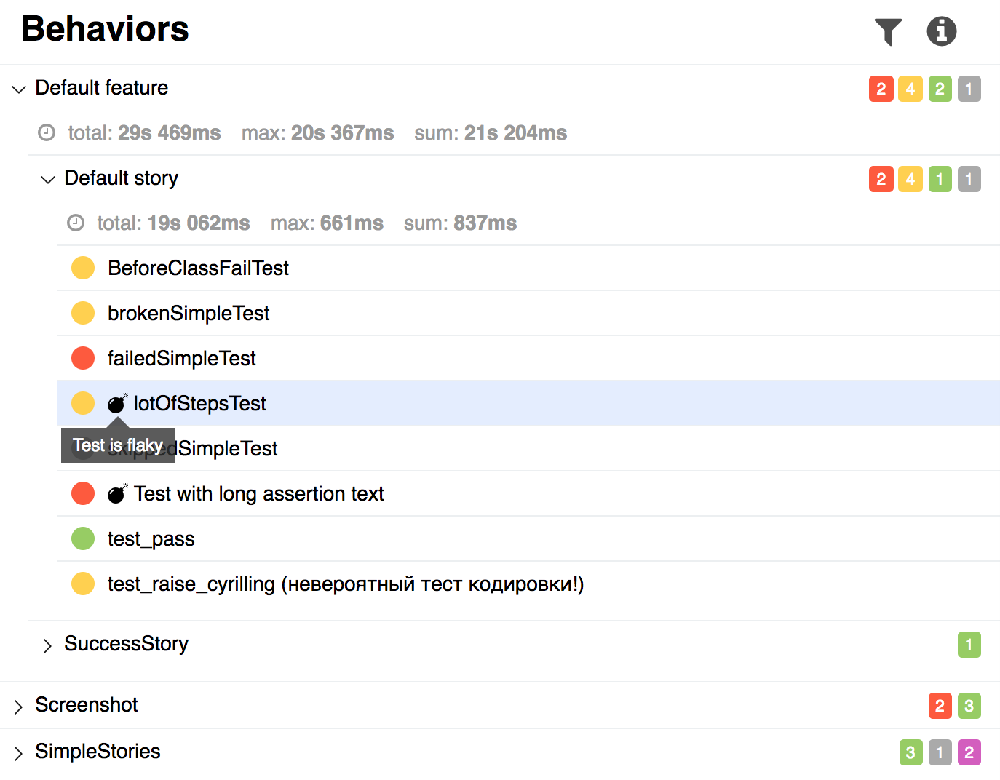
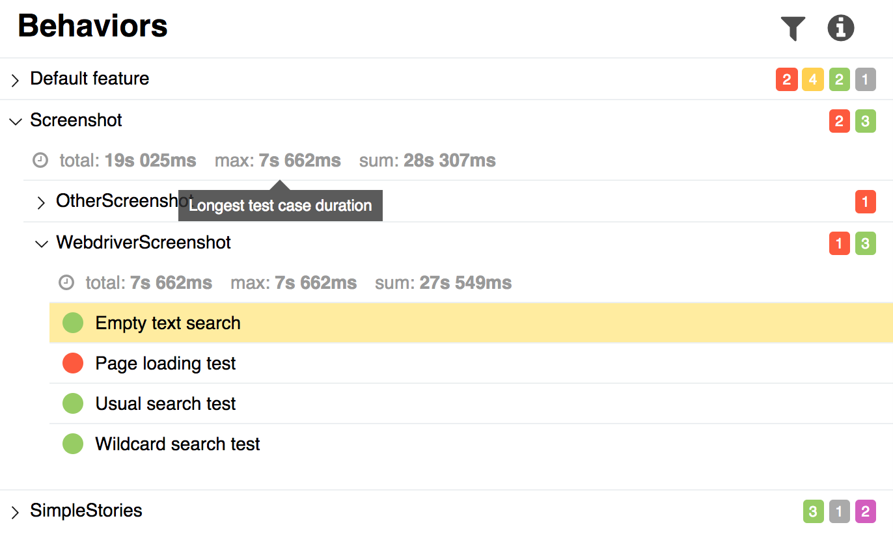
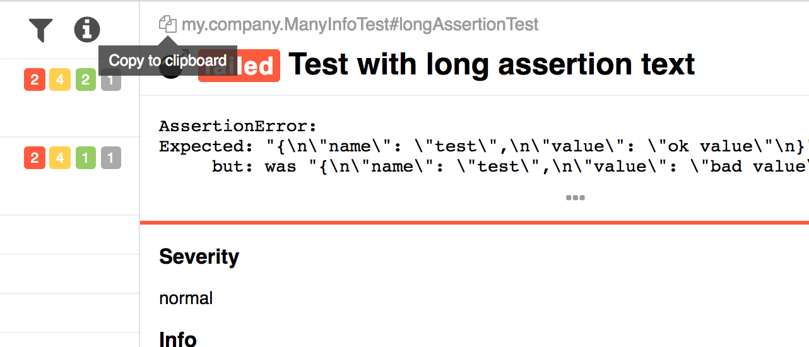

[download]: https://bintray.com/qameta/generic/allure2/2.0-BETA4
[milestone]: https://github.com/allure-framework/allure2/milestone/2?closed=1
[commits]: https://github.com/allure-framework/allure2/compare/2.0-BETA3...2.0-BETA4

It is my pleasure to announce that the Allure 2 beta release 4 is [available now][download].

Release contains several bug fixes (including command line for Darwin), 
some major changes (statuses), and visual improvements.

<!--more-->

First of all, we got rid of `pending` status. A reason for that was that we 
realized it's usually hard to determine what is the difference between `cancelled` 
and `pending` statuses, so we decided to use `skipped` instead of both. 
Also Allure now has support of `unknown` status - this status means that something 
went wrong, and Allure can't determine real test's status. Though to be honest, 
you should never expect to see it in your report (at least in a perfect world).

Furthermore, this release introduces `flaky` tests. As for now, adapters don't 
support this feature yet, the only way to use it, marking a test case as `flaky`, 
is to add to test case a label `status_details` with a value `flaky`. 

Also time information is now shown for test groups (you can switch this off by clicking on the information icon)

And finally, the ability to copy full name of test case to clipboard is back (flash free!)

That is pretty much it. The full list of changes you can find in related [milestone][milestone] or [commits list][commits].

Allure Team
