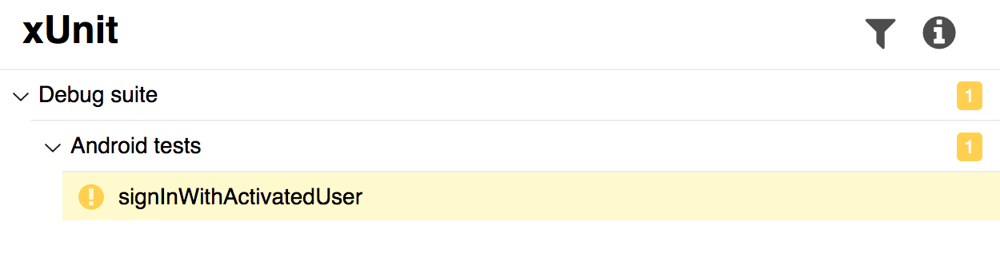

[download]: https://bintray.com/qameta/generic/allure2/2.0-BETA5
[commits]: https://github.com/allure-framework/allure2/compare/2.0-BETA4...2.0-BETA5
[milestone]: https://github.com/allure-framework/allure2/milestone/3?closed=1
[allure-java]: https://github.com/allure-framework/allure-java

Beta 5 is available to [download][download]. 

Release contains minor visual changes, such as icons for statuses in tree.

<!--more-->

Also Allure now supports nested suites for TestNG. This will work with new Allure TestNG integration,
available [here][allure-java]. It is already available in jcenter, so give it a try!

And finally, Allure now shows method names instead of titles in packages tab.

For a full list of changes you can watch out [list of commits][commits] or [milestone][milestone].

Regards,
Allure Team
