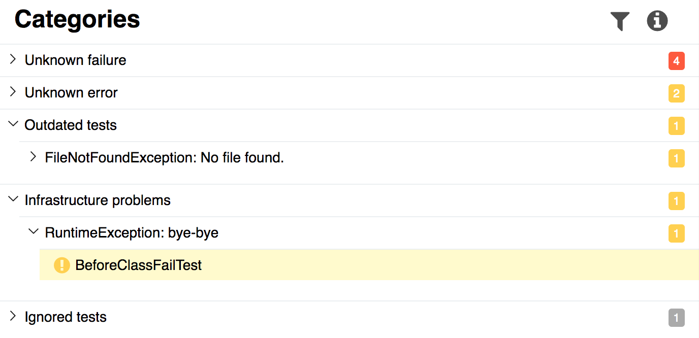
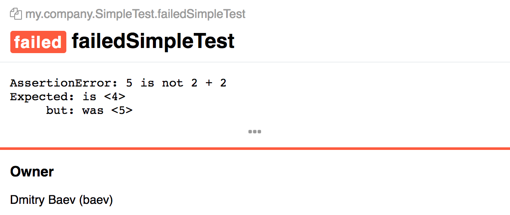
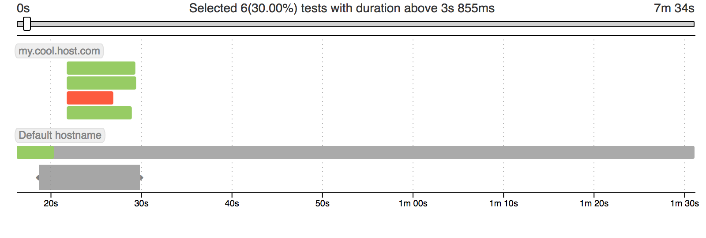
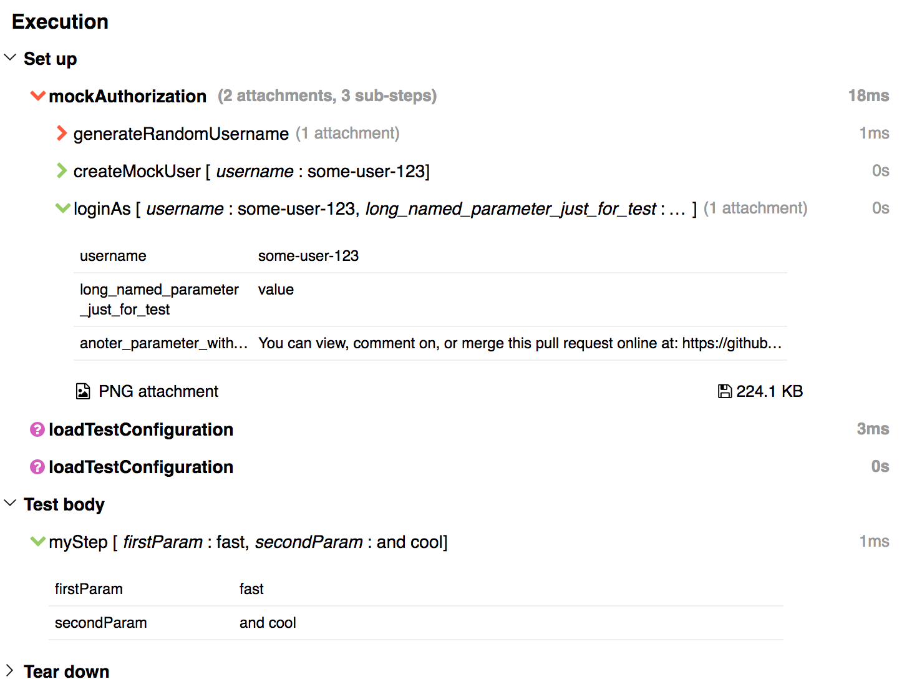

[download]: https://bintray.com/qameta/generic/allure2/2.0-BETA6
[milestone]: https://github.com/allure-framework/allure2/milestone/5?closed=1
[commits]: https://github.com/allure-framework/allure2/compare/2.0-BETA5...2.0-BETA6

It is my pleasure to announce that the Allure 2 beta release 6 is [available now][download].
This release contains some cool features improvements, such as new categories tab, test owner, 
timeline improvements.

<!--more-->

#### Categories

We replaced old Defects tab with a new one, called Categories. By default, all test errors
are split on two categories **Unknown Failures** and **Unknown Errors**. The first category
contains all failed tests, and the second one contains all tests with broken status. 



To add more categories you can create a file called `categories.json`, and specify all the 
categories you want to split your tests into.

```json
[
  {
    "name": "Ignored tests",
    "messageRegex": ".*ignored.*",
    "matchedStatuses": [ "skipped" ]
  },
  {
    "name": "Infrastructure problems",
    "traceRegex": ".*RuntimeException.*",
    "matchedStatuses": [ "broken", "failed" ]
  },
  {
    "name": "Outdated tests",
    "messageRegex": ".*FileNotFound.*",
    "matchedStatuses": [
      "broken"
    ]
  }
]
```

Then you'll need to place this file into the folder with tests results and generate the report.

#### Test owner

Now you can mark your tests with owner label. That will help you to find the person who is 
responsible for that failed test.
 


#### Improved Timeline

As you may know Timeline was pretty much unusable for a huge amount of tests. In the latest releases we added 
a brush that can help you solve that problem, and know we are introducing a duration filter for it:



#### Improved test execution

Allure now shows statuses for parent steps, step durations and for a count of attachments and sub-steps. Step parameters 
are now displayed in table inside step.




That is pretty much it! For a full list of changes you can explore our [list of commits][commits] or [milestone][milestone].

Regards, Allure Team
